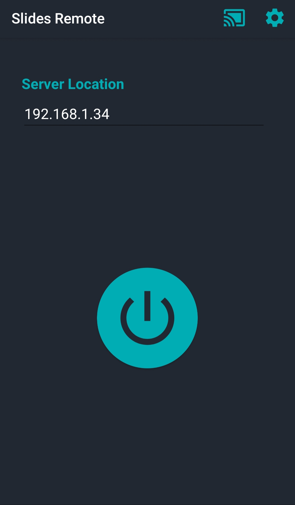
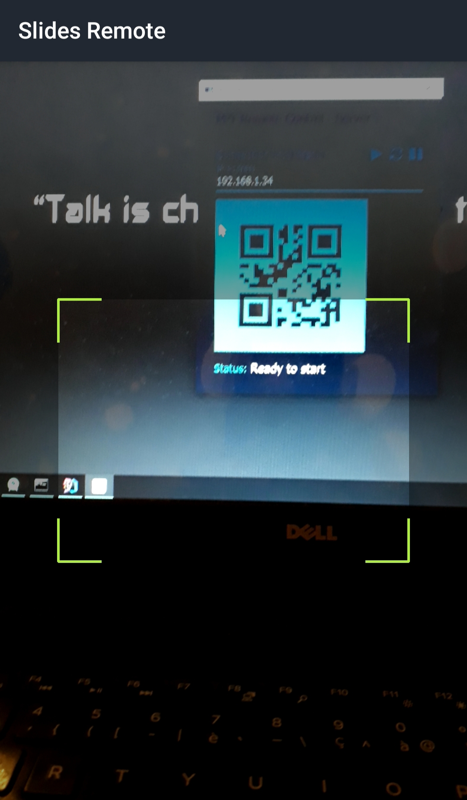
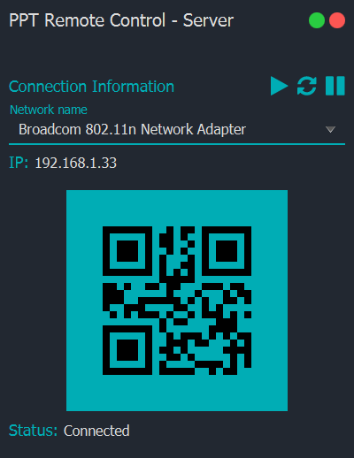

# Slides Remote :video_game:

WIFI Presentation Remote - Control Slides (like: MS PowerPoint) from your Android Phone.

## Features :dart:
* [x] Free & Open Source
* [x] Very Easy to use
* [x] No Internet connection required
* [x] Multi Platform App (We write once & you Run anywhere!)
* [x] You Can also Control your PC Slides anywhere in the world! (in this case you need Internet connection)
* [x] Control the Start, Stop, Next, Back of your presentation & also control the Volume (UP/Down/Mute)
## Screenshots
Home           | Scan Server IP :camera:
:---------------------:|:------------------:
 | 
Remote Control           | Server App
 | 

## Requirements
* Java 11+
* Computer & Phone connected on the same wireless (no internet required).

## Languages & Tools
* Android App :iphone:
  * Java
  * Card View (Material Design)
* Desktop App (Server) :computer:
  * JavaFX
  * JFoenix (Material design)
  * Ikonli (Icons)
* Zxing (QRCode Generator & Reader)
* Socket (Communication)

## Installation
1. Download the repository files (project) from the download section or clone this project by typing in the bash the following command:

       git clone https://github.com/HouariZegai/SlidesRemote.git
2. Open SlidesRemote project on Android Studio.
3. Import the SlidesRemote-Server project in Intellij IDEA or any other Java IDE and let Maven download the required dependencies for you.
4. Run the server app first (from maven).
5. Run the android app.

## Contributing 💡
If you want to contribute to this project and make it better with new ideas, your pull request is very welcomed.
If you find any issue just put it in the repository issue section, thank you.

## Contact me
Email: houarizegai14@gmail.com  
LinkedIn: [HouariZegai](https://linkedin.com/in/houarizegai)  
Twitter: [@HouariZegai](https://twitter.com/houarizegai)
